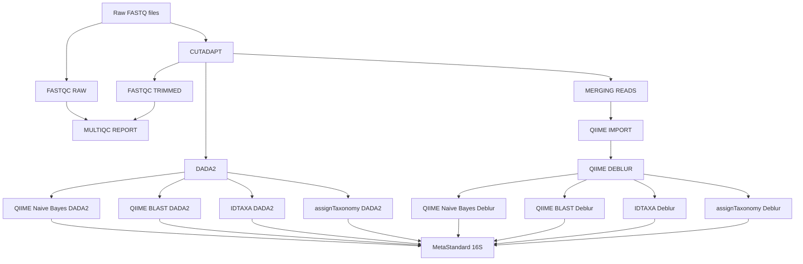

# 16S Profiling Pipeline Documentation

## Overview

This Nextflow pipeline performs taxonomic profiling of paired-end 16S rRNA amplicon data (V3V4 region). The pipeline integrates quality control, read preprocessing, and ASV inference and taxonomic assignment using multiple complementary tools (ASV inference: DADA2, DEBLUR and USEARCH-UNOISE; taxonomic assignment: QIIME BLAST, QIIME NAIVE BAYES, IDTAXA, ASSIGNTAXONOMY, SINTAX) to provide robust microbial community characterization.

**Pipeline Version:** 1.0.0  
**Author:** Petra Polakovicova  
**Nextflow Version Required:** ≥22.10.0

---

##  Testing Instructions

Instructions for testing the pipeline's reproducibility are available as 
[Markdown](docs/testing_readme.md), as well as in 
[PDF version](docs/testing_readme.pdf).

## Workflow Description

The pipeline implements the following workflow:



### Workflow Steps

1. **Quality Control (Raw Reads)**
   - Tool: FastQC v0.12.1	
   - Assesses raw read quality metrics	
   - Output: HTML reports and quality metrics	

2. **Read Preprocessing**
   - Tool: Cutadapt v5.2
   - Performs primer & adapter trimming

3. **Quality Control (Trimmed Reads)**
   - Tool: FastQC v.0.12.1
   - Validates reads after preprocessing (primers & adapters should be gone)
   - Output: HTML reports and quality metrics

4. **ASV inference - DADA2**
   - Tool: DADA2 v1.38.0
   - Performs ASV inference using divisive algorithm
   - Provides raw counts of each ASV in dataset
   - Runs in parallel with DEBLUR & UNOISE

5. **MERGING READS - BBMERGE**
   - Tool: BBMAP-BBMERGE vXY
   - Merges paired-end reads to create single-end reads
   - Needed for downstream ASV inference using DEBLUR and UNOISE

6. **ASV inference - DEBLUR**
   - Tool: Deblur plugin inside QIIME2 v2026.1
   - Performs quality filtering, length trimming, positive filtering using SORTMERNA & ASV inference using deblur algorithm
   - Provides raw counts of each ASV in dataset
   - Runs in parallel with DADA2 & UNOISE

7. **ASV inference - UNOISE**
   - TO DO 

8. **Taxonomic assignment - QIIME naive-bayes classifier**
   - Tool: qiime feature-classifier classify-sklearn inside QIIME2 v2026.1
   - Performs taxonomic classification using pre-built classifier, which was made using REscript plugin (see extract_silva.sh)  
   - This classifier is run on all three ASV-inference approaches (DADA2, DEBLUR, UNOISE) 
   - Runs in parallel with four different taxonomic classifiers

9. **Taxonomic assignment - QIIME BLAST classifier** 
    - Tool: classify-consensus-blast inside QIIME2 v2026.1 
    - Performs taxonomic classification using pre-built classifier, which was made using REscript plugin (see extract_silva.sh) 
    - This classifier is run on all three ASV-inference approaches (DADA2, DEBLUR, UNOISE)  
    - Runs in parallel with four different taxonomic classifiers

9. **Taxonomic assignment - IDTAXA**  
    - Tool: R function DECIPHER::IdTaxa() v3.6.0
    - Performs taxonomic classification using pre-built classifier, which was made using QIIME2's REscript plugin (see extract_silva.sh) and train_idtaxa.R script. 
    - This classifier is run on all three ASV-inference approaches (DADA2, DEBLUR, UNOISE)  
    - Runs in parallel with four different taxonomic classifiers

10. **Taxonomic assignment - AssignTaxonomy** 
    - Tool: R function dada2::assignTaxonomy() v1.38.0  
    - Performs taxonomic classification using pre-built classifier, which was made using QIIME2's REscript plugin (see extract_silva.sh). 
    - This classifier is run on all three ASV-inference approaches (DADA2, DEBLUR, UNOISE)
    - Runs in parallel with four different taxonomic classifiers

11. **Quality Report Aggregation**
    - Tool: MultiQC v1.21
    - Aggregates QC metrics from FastQC and Fastp
    - Generates comprehensive HTML report

---

## Tools and Versions


| Tool | Version | Container Source | Purpose |
|------|---------|-----------------|---------|
| **FastQC** | 0.12.1 | quay.io/biocontainers/fastqc:0.12.1--hdfd78af_0 | Quality control assessment of raw and trimmed reads |
| **Cutadapt** | 5.2 | quay.io/biocontainers/cutadapt:5.2--py310hdfd78af_0 | Primer and adapter trimming |
| **DADA2** | 1.38.0 | quay.io-biocontainers-bioconductor-dada2:1.38.0--r45ha27e39d_0 | ASV inference using divisive algorithm |
| **BBMAP-BBMERGE** | 39.52 | quay.io-biocontainers-bbmap:39.52--he5f24ec_0 | Merges paired-end reads into single-end reads |
| **QIIME2 Deblur plugin** | 2026.1 | qiime2/core:2026.1 | Quality filtering and ASV inference via Deblur |
| **UNOISE** | TO DO | TO DO | ASV inference (method TBD) |
| **QIIME naive-bayes classifier** | 2026.1 | quay.io-qiime2-amplicon:2026.1 | Taxonomic assignment using pre-trained sklearn classifier |
| **QIIME BLAST classifier** | 2026.1 | quay.io-qiime2-amplicon:2026.1 | Taxonomic assignment using BLAST classifier |
| **IDTAXA (DECIPHER)** | 3.6.0 | quay.io-biocontainers-bioconductor-decipher-3.6.0--r45h01b2380_0 | Taxonomic assignment using DECIPHER IdTaxa function |
| **AssignTaxonomy (DADA2)** | 1.38.0 | quay.io-biocontainers-bioconductor-dada2:1.38.0--r45ha27e39d_0 | Taxonomic assignment using DADA2 assignTaxonomy function |
| **MultiQC** | 1.21 | quay.io/biocontainers/multiqc:1.21--pyhdfd78af_0 | Aggregates QC metrics into a single report |


### Container Technology

The pipeline uses **Singularity** containers for reproducibility and portability. All containers are automatically pulled and cached in the directory specified by `singularity_cache_dir`.

---

## Installation

### Prerequisites

The pipeline uses Nextflow ≥22.10.0 and Singularity which is assumed to be pre-installed by the user. Users will need at least 8 GB of RAM, 5 GB of storage for downloading the classifier and Singularity images, and additional storage for running the pipeline (this can vary depending on how many samples you have).

### Quick Setup (Recommended)

The pipeline includes an automated setup script that downloads all required databases and containers.

**Run the setup script:**

```bash
# Interactive mode (will prompt for installation directory)
./setup_pipeline.sh

# Or specify directory directly
./setup_pipeline.sh /shared/pipeline_resources
```

**What the script does:**

1. Creates directory structure:
   - `classifiers/` - pre-built taxonomic classifiers (~500MB)
   - `singularity_cache/` - Container images (~5 GB)
   - `logs/` - Setup logs

2. Downloads pre-builts taxonomic classifiers from Zenodo

3. Pulls all required Singularity containers

5. Generates a configuration file (`pipeline_paths.config`) with all paths

**After setup completes:**

```bash
# Run the pipeline - database paths are already configured!
nextflow run main.nf \
  --input samples.csv \
  --outdir results

# Or use the generated config for explicit paths
nextflow run main.nf \
  -c /path/to/pipeline_paths.config \
  --input samples.csv \
  --outdir results
```

> [!NOTE]
> After running the setup script, the default database paths in `nextflow.config` point to `./classifiers`. If you installed to a different location, either use the generated `pipeline_paths.config` file or specify paths via command-line parameters.


## Input Requirements

### Samplesheet Format

The pipeline requires a CSV samplesheet with the following columns:

| Column | Description |
|--------|-------------|
| `sample` | Unique sample identifier |
| `read1` | Absolute or relative path to R1 FASTQ file (can be gzipped) |
| `read2` | Absolute or relative path to R2 FASTQ file (can be gzipped) |

**Example samplesheet (`samplesheet.csv`):**
```csv
sample,read1,read2
sample1,/path/to/sample1_R1.fastq.gz,/path/to/sample1_R2.fastq.gz
sample2,/path/to/sample2_R1.fastq.gz,/path/to/sample2_R2.fastq.gz
sample3,/path/to/sample3_R1.fastq.gz,/path/to/sample3_R2.fastq.gz
```

> [!NOTE]
> - Sample names must be unique
> - File paths can be absolute or relative to the working directory
> - FASTQ files can be compressed (.gz) or uncompressed

---

## Running the Pipeline

To solve potential issue of the singularity tmp directory, please export the SINGULARITY_TMPDIR in your run script

```bash
export SINGULARITY_TMPDIR=/path/to/directory/with/space
```

### Basic Usage

**If you used the setup script (databases in default locations):**

```bash
nextflow run main.nf \
  --input samplesheet.csv \
  --outdir results
```

**If classifiers are in custom location:**

```bash
nextflow run main.nf \
  --input samplesheet.csv \
  --outdir results \
  --classifiers /path/to/classifiers_dir
```

## Output Structure

The pipeline generates the following output directory structure:

```
results
├── 01_fastqc_raw
│   ├── SRR13005968-test_1_fastqc.html
│   ├── SRR13005968-test_1_fastqc.zip
│   ├── ...
├── 01_fastqc_trimmed
│   ├── SRR13005968-test_R1.trimmed_fastqc.html
│   ├── SRR13005968-test_R1.trimmed_fastqc.zip
│   ├── ...
├── 02_cutadapt
│   ├── SRR13005968-test_R1.trimmed.fastq.gz
│   ├── SRR13005968-test_R2.trimmed.fastq.gz
│   ├── ...
├── 03_dada2
│   ├── ASV_sequences.fasta
│   ├── asv_table.tsv
│   └── track_control.tsv
├── 04_bbmap
│   ├── SRR13005968-test-mergedpairs.fastq.gz
│   ├── SRR13005969-test-mergedpairs.fastq.gz
│   ├── ..
├── 05_deblur
│   ├── asv_table.tsv
│   ├── dna-sequences.fasta
│   └── stats.csv
├── 07a_qiime_naive_bayes
│   ├── dada2_taxa_table.tsv
│   └── deblur_taxa_table.tsv
├── 07b_qiime_blast
│   ├── dada2_taxa_table.tsv
│   └── deblur_taxa_table.tsv
├── 07c_assigntaxonomy
│   ├── dada2_taxa_table.tsv
│   └── deblur_taxa_table.tsv
├── 07d_idtaxa
│   ├── dada2_taxa_table.tsv
│   └── deblur_taxa_table.tsv
├── 08_multiqc
│   ├── multiqc_citations.txt
│   ├── multiqc_data.json
│   ├── multiqc_fastqc.txt
│   ├── multiqc_general_stats.txt
│   ├── multiqc.log
│   ├── multiqc_report.html
│   ├── multiqc_report_data
│   ├── multiqc_sources.txt
│   └── multiqc_software_versions.txt
└── pipeline_info
    ├── dag.svg
    ├── report.html
    ├── timeline.html
    └── trace.txt
```

### Output Descriptions

| Directory | Contents | Description |
|-----------|----------|-------------|
| `01_fastqc_raw/` | FastQC HTML & ZIP reports | Quality metrics for raw reads |
| `01_fastqc_trimmed/` | FastQC HTML & ZIP reports | Quality metrics for trimmed reads (after Cutadapt) |
| `02_cutadapt/` | Trimmed FASTQ files | Reads after adapter and primer removal |
| `03_dada2/` | ASV tables & FASTA sequences | DADA2 ASV inference outputs |
| `04_bbmap/` | Merged FASTQ reads | Paired-end reads merged for Deblur/UNOISE |
| `05_deblur/` | ASV tables & FASTA sequences | Deblur ASV inference outputs |
| `07a_qiime_naive_bayes/` | Taxa tables (DADA2 & Deblur) | Taxonomic assignment using QIIME naive-bayes classifier |
| `07b_qiime_blast/` | Taxa tables (DADA2 & Deblur) | Taxonomic assignment using QIIME BLAST classifier |
| `07c_assigntaxonomy/` | Taxa tables (DADA2 & Deblur) | Taxonomic assignment using DADA2 assignTaxonomy |
| `07d_idtaxa/` | Taxa tables (DADA2 & Deblur) | Taxonomic assignment using DECIPHER IdTaxa |
| `08_multiqc/` | MultiQC reports & JSON/logs | Aggregated QC metrics from all tools and samples |
| `pipeline_info/` | HTML, DAG, trace, timeline | Pipeline execution reports and workflow DAG |

---

## Citations

If you use this pipeline, please cite:

- **Nextflow:** Di Tommaso, P., et al. (2017). Nextflow enables reproducible computational workflows. Nature Biotechnology, 35(4), 316-319.
- **FastQC:** Andrews, S. (2010). FastQC: A Quality Control Tool for High Throughput Sequence Data.
- **MultiQC:** Ewels, P., et al. (2016). MultiQC: summarize analysis results for multiple tools and samples in a single report. Bioinformatics, 32(19), 3047-3048.
- **DADA2:** Callahan,  et al. (2016).  DADA2: High-resolution sample inference from Illumina amplicon data. Nat Methods 13, 581–583.
- **DEBLUR:** Amir, A., et al. (2017). Deblur Rapidly Resolves Single-Nucleotide Community Sequence Patterns. mSystems, 2(2), e00191-16. 
- **QIIME2:** Bolyen E, et al.(2019). Reproducible, interactive, scalable and extensible microbiome data science using QIIME 2. Nature Biotechnology 37: 852–857. 
- **DECIPHER:** ES Wright (2024). Fast and Flexible Search for Homologous Biological Sequences with DECIPHER v3."The R Journal, 16(2), 191-200.
